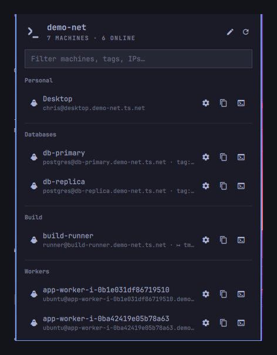

# Tailscale SSH

An Omarchy bar widget that lists the machines on your tailnet and opens an SSH
terminal into any of them, working out the login user for you.



Omarchy's built-in Tailscale widget shows your machines and copies their
addresses. This one connects to them.

## Why the rules are not just a list of hostnames

Autoscaled machines join and leave a tailnet under names nobody chose:

```
app-worker-i-0b1e031df86719510    tag:role-worker
media-encoder-i-03a09331616e96f5d tag:role-encoder
```

You cannot write those down — they will be different tomorrow. So rules match on
**hostname prefix, ACL tag, regex, or exact hostname**, and setup works out which
of those your tailnet needs.

## Install

```bash
omarchy plugin add https://github.com/diddado/omarchy-tailscale-ssh.git --enable
```

Then click the `>_` icon in the bar and press **Run setup**.

Setup reads your tailnet, groups the machines it finds, and asks which user to
log in as for each group. It never guesses a username: a wrong `ubuntu` that
looks like it was detected is worse than a blank you were asked to fill in.

You can re-run it any time:

```bash
~/.config/omarchy/plugins/io.github.diddado.tailscale-ssh/bin/setup
```

Requires the `tailscale` CLI, which the plugin looks for at `/usr/bin/tailscale`,
`/usr/local/bin/tailscale` or `/opt/tailscale/tailscale` — absolute paths rather
than `$PATH`, so another process cannot decide which binary answers. `wl-copy`
(wl-clipboard) backs the copy actions and `gum` draws the setup wizard; both are
in Omarchy's base package set. `python3` and `jq` are used by the helpers in
`bin/` and ship with the system.

The plugin only ever runs `tailscale status --json`. It never brings the tailnet
up or down, and it needs no elevated privileges — nothing here uses `sudo` or
`pkexec`.

## Using it

| | |
|---|---|
| Click the icon | Open the machine list |
| Type | Filter by name, label, group, user, IP, or tag |
| `Enter` | SSH into the selected machine |
| Terminal button | SSH into that machine |
| Gear button, or `Alt+E` | Configure the login user for that machine |
| `Alt+Y` / `Alt+C` | Copy the `ssh …` command / the Tailscale IP |
| `Alt+R` | Reload the machine list and the rules file |
| `Esc` | Clear the filter, then close |

Connections open in your default terminal with a per-machine window id
(`org.omarchy.tailssh-<machine>`), so Hyprland window rules can target them.

## Configuring

Most changes are one click: the **gear** on any row opens a small form for the
SSH user, port, and a command to run on connect. The **Apply to** chips decide
how far the change reaches — just that machine, everything sharing its prefix,
or everything carrying one of its tags. Configuring one member of a fleet
configures the fleet.

The panel header has a **?** that opens this documentation in your browser and a
**pencil** that opens the rules file in your editor. The file itself starts with
a `_readme` block listing every matcher and field, so the options are in front of
you while you edit — no need to come back here. That block is rewritten by the
plugin on each save, so it stays in step with the installed version.

The rules file lives at:

```
~/.local/state/omarchy/settings/io.github.diddado.tailscale-ssh.json
```

Edits apply immediately — no restart. The file is created mode `0600`, in a
directory created `0700`, and is never read or written through its name
directly; see [Security](#security).

```json
{
  "version": 2,
  "defaultUser": "you",
  "sshArgs": ["-o", "ServerAliveInterval=30"],
  "tailnets": {
    "tailabc123.ts.net": {
      "name": "acme.com",
      "rules": [
        { "prefix": "app-", "user": "ubuntu", "group": "App tier" },
        { "prefix": "app-worker-", "group": "Workers" },
        { "tag": "role-db", "user": "postgres" },
        { "regex": "^db-\\d+$", "port": 2222 },
        { "host": "desktop", "user": "chris", "label": "Desktop", "group": "Home" }
      ]
    }
  }
}
```

### More than one Tailscale account

Rules live under `tailnets`, keyed by the tailnet's MagicDNS suffix. Switching
accounts changes the machines completely, so rules written for one tailnet would
be meaningless — and actively misleading — on another.

Switch to a tailnet the plugin has not seen, and the panel says so and offers to
set it up. Running setup adds a section for that tailnet and **leaves every other
section untouched**, so you can keep one configuration per account and switch
freely.

`defaultUser` and `sshArgs` at the top level apply everywhere; a tailnet can
override `defaultUser` and adds to `sshArgs`.

The key is the MagicDNS suffix rather than the account name because it is unique,
survives a tailnet rename, and is readable from an unprivileged
`tailscale status`. Listing accounts (`tailscale switch --list`) needs root or an
operator grant, so the plugin never depends on it.

### How rules combine

Each rule carries exactly one matcher:

| Matcher | Matches |
|---|---|
| `host` | Exact machine name or full MagicDNS name, case-insensitive |
| `tag` | A Tailscale ACL tag; the `tag:` prefix is optional |
| `regex` | JavaScript regex against the machine name |
| `prefix` | Machine-name prefix — the **longest** match wins |

Matching rules are applied weakest to strongest:

```
defaults  <  prefix  <  regex  <  tag  <  host
```

They **merge** rather than compete. A prefix rule can set the user for a whole
fleet while an exact-host rule overrides only that one machine's port; fields you
do not mention are inherited rather than reset. `sshArgs` accumulate across
tiers, so a global keepalive survives a rule that adds an identity file.

### Rule fields

All optional, all settable at any tier:

| Field | Effect |
|---|---|
| `user` | SSH login user |
| `port` | `ssh -p` |
| `sshArgs` | Extra flags — an array, or a string split on whitespace |
| `command` | Run this on arrival instead of a login shell (adds `ssh -t`) |
| `label` | Friendlier display name |
| `group` | Section heading to file the machine under |
| `address` | Override what ssh connects to |
| `hidden` | `true` drops the machine from the list |

Top level: `defaultUser`, `sshArgs`, `connectVia`, `rules`.

### Landing in tmux instead of a login shell

`command` runs something on arrival. The plugin adds `ssh -t` for you, which
allocates the TTY that a full-screen program needs:

```json
{ "host": "build-runner", "command": "tmux new -A -s work" }
```

`tmux new -A -s work` attaches to the session named `work`, **creating it first
if it does not exist** — that `-A` is what makes it safe to use as a connect
command. Without it, `tmux new -s work` fails the second time you connect
because the session is already there.

Since rules merge, one line gives it to a whole fleet:

```json
{ "prefix": "app-worker-", "user": "ubuntu", "command": "tmux new -A -s ops" }
```

Other things worth putting there:

```json
{ "tag": "role-db",  "command": "psql -U postgres" }
{ "host": "logs-01", "command": "journalctl --user -fu myapp" }
{ "host": "docker-1","command": "docker compose logs -f" }
```

A machine with a `command` shows it in the panel with a `↦` marker, so you can
see at a glance which rows do something other than open a shell.


## Widget settings

Stored inline on the widget's entry in `~/.config/omarchy/shell.json`:

```bash
omarchy bar set io.github.diddado.tailscale-ssh refreshIntervalSec 60 --json
omarchy bar set io.github.diddado.tailscale-ssh connectVia ip
```

| Key | Default | Purpose |
|---|---|---|
| `refreshIntervalSec` | `30` | How often `tailscale status` is polled |
| `configPath` | *(state dir)* | Move the rules file elsewhere — an absolute path, or one starting `~/` |
| `connectVia` | `dns` | `dns` \| `ip` \| `hostname` |
| `showOffline` | `true` | List offline machines, dimmed |
| `focusFilterOnOpen` | `true` | Type to filter the moment the panel opens |

Numbers and booleans need `--json`, or they land in `shell.json` as strings.

The fallback login user is not a widget setting: it is `defaultUser` in the rules
file, and with that unset it is your local `$USER`.

## Removing

```bash
omarchy plugin remove io.github.diddado.tailscale-ssh
```

That deletes the plugin directory and its entry in `~/.config/omarchy/shell.json`.
It does **not** delete anything the plugin wrote outside its own directory, and
nothing else does either. Everything that survives removal is listed here:

| Path | What it holds | Removal |
|---|---|---|
| `~/.local/state/omarchy/settings/io.github.diddado.tailscale-ssh.json` | Your rules: hostnames, groups, login users, ports, connect commands | Kept |
| `~/.local/state/omarchy/settings/io.github.diddado.tailscale-ssh.json.bak.<timestamp>` | One snapshot of the previous rules per `bin/setup` run | Kept |

Both are mode `0600`. To delete them too:

```bash
rm -f ~/.local/state/omarchy/settings/io.github.diddado.tailscale-ssh.json \
      ~/.local/state/omarchy/settings/io.github.diddado.tailscale-ssh.json.bak.*
```

There is nothing else to undo. The plugin installs no service, no timer, no
hook, no sudoers rule and no polkit action; it starts no background process that
outlives the shell; it never edits `~/.config/hypr` or any other component's
files; and the terminals it opens are ordinary `ssh` sessions that end when you
close them.

## Security

A bar widget runs inside `omarchy-shell` — the one long-lived process that draws
every other widget on the desktop — and almost nothing it handles is a value it
chose. Hostnames, tags and DNS names come from whoever owns each machine on the
tailnet. The rules file is a plain-text document any other process running as
this user can rewrite. Both are treated accordingly.

**No value ever becomes a command.** Every process is an argv vector; no shell
string is built from data anywhere in the tree. The `ssh` destination goes after
`--`, and it is validated besides: `ssh` parses argv with getopt, so a machine
that names itself `-oProxyCommand=…` would otherwise turn its own hostname into
a command on your desktop. A destination or login user that does not validate is
**refused and reported**, never repaired — a silently corrected hostname would
connect somewhere other than where you meant. The per-machine window id is held
to `[A-Za-z0-9._-]` because `omarchy-launch-tui` expands it unquoted.

**Nothing is read or written through a pathname.** `bin/statefile` is the one
place the rules file is touched. It walks the directory chain from a trusted
anchor with held descriptors, opens the file once with
`O_NOFOLLOW|O_NONBLOCK|O_CLOEXEC`, and validates *that descriptor* — regular
file, owned by you, one link, under the size ceiling — before reading a bounded
number of bytes from it. Writes create an unpredictably named temporary in the
destination directory at mode `0600` before the first byte, `fsync` it, and
`rename` it into place; `rename(2)` replaces a symlink at the destination rather
than writing through it. If the containing directory is writable by group or
other, those bits are removed on every write — not only when the mode currently
looks wrong, because a directory that was ever writable may already hold a name
someone else planted. (Read and execute bits are left as you set them: they do
not expose a `0600` file, and `~/.local/state` being `0755` is normal.)
`FileView` is used as an inotify watcher only (`preload: false`,
`blockAllReads: true`) and never opens the file.

**Everything is bounded at the producer.** `bin/tailscale-status` runs the CLI in
its own session under an absolute deadline with `TERM` → `KILL` escalation, and
caps stdout at 1 MiB + 1 byte so an overflow is detected rather than truncated;
stderr is capped separately. The panel counts bytes as chunks arrive and kills
the producer on overflow — there is no `StdioCollector` anywhere. After the byte
cap come the ones that matter just as much: peer count, tag count, address
count, rule count, string length, `regex` pattern length, and recursion depth.
Collections keyed by names from the network or the file use null-prototype maps.

**Every string that reaches the screen names its format.** Qt renders a string
that looks like markup as rich text, and rich text loads `` — a real
request out of the shell process to a URL the string's author picked. Every
`Text` in this plugin sets `textFormat: Text.PlainText`, literal ones included,
so the invariant is greppable. The shell's own components (`PanelHero`,
`PanelSectionHeader`, tooltips) cannot be pinned from a plugin, so anything
variable reaching one has `<`, `>`, `&`, control characters and bidi overrides
stripped and its length capped first.

**Executables are absolute.** `$PATH` is inherited from the shell process and
another process running as this user can prepend to it, so every helper is
invoked by absolute path and every helper process runs with `clearEnvironment`
and a minimal environment — no `BASH_ENV`, no `PYTHONPATH`, no `LD_PRELOAD`.

**No privilege, no network, no supply chain.** The plugin runs one command,
`tailscale status --json`, and never mutates Tailscale state. It makes no HTTP
request of its own. It installs nothing, downloads nothing, builds nothing and
updates nothing; the reviewed commit is the code that runs. Loading the widget
is read-only — even the state directory is created on your first save, not at
mount. There are no bundled binaries and no agent instruction files in the tree.

`test/statefile.test.sh` mounts the actual attacks (planted symlink, planted
FIFO, hard link, oversized file, widened directory, symlinked parent) and
asserts each is refused; `test/audit.test.sh` re-checks the greppable invariants
above so a later edit cannot quietly drop one.

## Development

```bash
./scripts/dev-install.sh          # symlink this checkout into Omarchy
node test/model.test.js           # rule engine, argv construction, bounds
bash test/setup.test.sh           # config generator, against fixture tailnets
bash test/statefile.test.sh       # file-handling races, against real attacks
bash test/audit.test.sh           # static invariants across the tree
omarchy plugin validate .         # manifest schema
omarchy restart shell             # reload after a QML edit
```

`Model.js` holds the pure logic and carries the tests. `Service.qml` owns
subprocesses and config I/O; `Panel.qml` is presentation and the keyboard cursor
model. `bin/setup` generates rules and depends only on bash and `jq`;
`bin/statefile` and `bin/tailscale-status` are the two I/O boundaries, and both
`Service.qml` and `bin/setup` go through them rather than reimplementing the
checks — one implementation means one place to get it right.

A note that will save you time: editing a bar widget's QML needs
`omarchy restart shell`. The inotify watcher fires and
`omarchy-shell shell rescanPlugins` reloads the manifest, but neither swaps the
QML of a widget that is already mounted. That is why most of the logic lives in
`Model.js`, where the test loop is instant.

## License

MIT — see [LICENSE](LICENSE).
